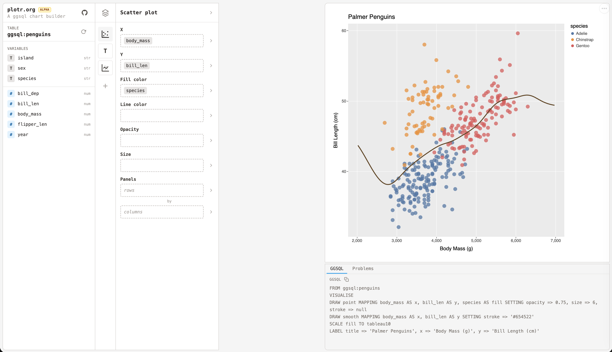

# plotr

<!---->

> Reproducible chart-building. Variables go in, ggsql comes out.

**[Try it → plotr.org](https://plotr.org)**



## Why?

Creating charts is hard. All charting systems do the same, but there's something special about the ones based off of [The Grammar of Graphics](https://link.springer.com/book/10.1007/0-387-28695-0). [ggsql](https://ggsql.org/) is one of these special systems.

It's not possible to explain why these systems are so good with a list of features, you have to _experience_ them. Even so ggsql is a new language, and it can be hard to wrap your head around the new terms and concepts. That's where [plotr](https://plotr.org) comes in!

## Run locally

```sh
npm install
npm run dev
```

Open <http://localhost:5173>.

## Status

This is in **Alpha**. Which means most likely there will be big changes. There's heavy use of AI, and for now about 90% of the code is not reviewed.
But as soon as the main features stop moving around, I'll do a proper code review.

- plotr is based on ggsql which is also alpha. And ggsql, for the moment, uses vegalite which has limitations of its own
- The file loading is limited. It only accepts CSVs and import options can't be configured (for now)
- The tutorial is wonky
- There are chart types missing
- Time variables were not even considered
- etc.

## Learn More

- [MANUAL.md](./MANUAL.md) — feature reference.
- [GGSQL_DEFAULTS.md](./GGSQL_DEFAULTS.md) — ggsql aesthetic + per-geom defaults.
- [ggsql](https://ggsql.org/) — the language plotr generates. plotr is unaffiliated.

## License

MIT — see [LICENSE](./LICENSE).
